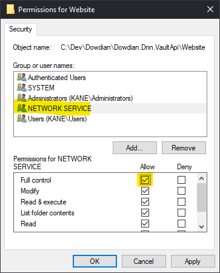
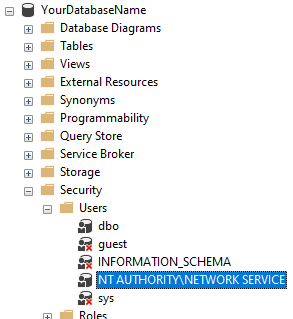
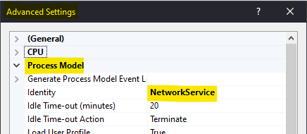
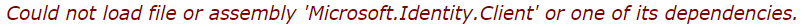
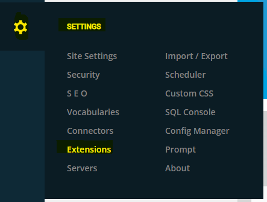
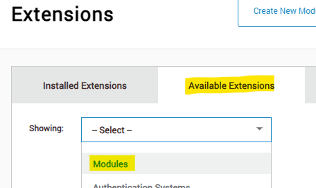
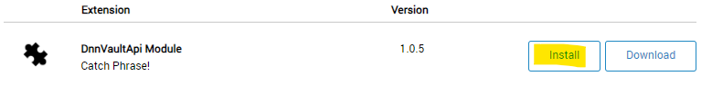

# DNN Azure Key Vault Web API
## Introduction
__Please Note__: 
These instructions are accurate as of May 18, 2024. If you're reading this in the future (which I presume you are), you may need to adjust the instructions to match the current state of the Azure portal. This is what made creating this project so damn hard. _All_ the instructions, tutorials and sample projects I could find were convoluted and/or out of date. This goal of this project is to create a simple project that people (i.e: me) can learn from.

This solution was built using the [Upendo DNN Generator](https://github.com/UpendoVentures/generator-upendodnn#readme). If you're already familiar you'll have a head start, but if you're not don't worry. We'll walk through the set up from the beginning. Oh, and if you're not familiar with DNN, Cloning a Repo, web.config files, or Microsoft Azure, you may be in the wrong place.

This project is at the proof of concept stage. The end goal is to manage secrets stored in Azure Key Vault in the most secure way possible. There may well be some obvious gaps. Please point them out with kindness.

This solution:
 - Uses a self-signed 4096 bit certificate to authenticate to Azure Key Vault. 
 - Includes basic CRUD methods for managing the Secrets implemented as Web API methods available to authenticated processes within a DNN instance. 
 - Does not modify the schema of the DNN database.
 - Can be used either in a development environemnt (localhost) or in an Azure App Service instance. These instructions focus on a localhost setup (for now).

<hr />  

## Environment Setup

### DNN Setup
To begin, let's get DNN and the project set up.
1. Clone this repository to a directory close to the root of your local machine (to avoid any potential issues with long paths).
1. Create a new folder in the root of the solution called `Website`.
1. Give the `NETWORK SERVICE` account full permissions on the `Website` directory to allow IIS to read and write to the directory.
    
1. Unzip a [fresh copy of DNN](https://github.com/dnnsoftware/Dnn.Platform/releases) into the new `Website` directory.
1. Create a database in your local SQL Server instance using the following script:
    ```sql
    USE [master]
    GO
    CREATE DATABASE [YourDatabaseName]
        CONTAINMENT = NONE
        ON  PRIMARY ( NAME = N'[YourDatabaseName]', FILENAME = N'[FolderWhereDatabaseFilesGo]\[YourDatabaseName].mdf' , SIZE = 8192KB , FILEGROWTH = 65536KB )
        LOG ON ( NAME = N'[YourDatabaseName]_log', FILENAME = N'[FolderWhereDatabaseFilesGo]\[YourDatabaseName]_log.ldf' , SIZE = 8192KB , FILEGROWTH = 65536KB )
     WITH LEDGER = OFF
    GO

    USE [YourDatabaseName]
    GO
    IF NOT EXISTS (SELECT name FROM sys.filegroups WHERE is_default=1 AND name = N'PRIMARY') ALTER DATABASE [YourDatabaseName] MODIFY FILEGROUP [PRIMARY] DEFAULT
    GO
    ```
	> Replace `YourDatabaseName` and `FolderWhereDatabaseFilesGo` with appropriate values.
1. Run the following SQL Script against your new database to allow IIS to attach to it using the `NETWORK SERVICE` account:
	```sql
	USE [YourDatabaseName]
	GO
	CREATE USER [NT AUTHORITY\NETWORK SERVICE]
	GO
	ALTER AUTHORIZATION ON SCHEMA::[db_owner] TO [NT AUTHORITY\NETWORK SERVICE]
	GO
	ALTER ROLE [db_owner] ADD MEMBER [NT AUTHORITY\NETWORK SERVICE]
	GO
	```
	> Replace `YourDatabaseName` with the appropriate value.
    
    

1. Open IIS Manager and add an Application under the Default Web Site with the following settings:
	- Alias: `DnnVaultApi`
	- Physical Path: `C:\[PathToYourProjectDirectory]\Website`
        > Replace `PathToYourProjectDirectory` with the appropriate value.
	- Application Pool: `DefaultAppPool`
	    > Note: If you already have applications running under your DefaultAppPool, you may want to create a new AppPool for this application.
1. Modify the DefaultAppPool (or the AppPool of your choice) to use the `NETWORK SERVICE` account as its identity.
    
1. Using your favorite browser, navigate to `http://localhost/DnnVaultApi` to complete the DNN installation process      .
	- Give the host user a password.
    - Database Setup: `Custom`
    - Database Typw: `SQL Server/SQL Server Express Database`
    - Server Name: `(local)`
	- Database Name: `YourDatabaseName`
	- Security: `Integrated`
    - All other values can be left as their default values.
1. Open the solution in Visual Studio and build it in **Release mode**. This will create the installer files in the `.\Website\Install\Modules` directory.
### 🚀 Witness the destructive power of this fully *inoperational* DNN instance 🚀


11. This is the part that troubles me the most with the solution as it currently stands! I would very much like to know how to do away with this requirement entirely. Any way, now modify the web.config file with the following settings so that the site will work again:
    ```
    <configuration>
      <runtime>
        <assemblyBinding ...>
          <dependentAssembly>
            <assemblyIdentity name="Azure.Core" publicKeyToken="92742159e12e44c8" />
            <bindingRedirect oldVersion="0.0.0.0-32767.32767.32767.32767" newVersion="1.39.0.0" />
          </dependentAssembly>
          <dependentAssembly>
            <assemblyIdentity name="System.Web.Http" publicKeyToken="31bf3856ad364e35" />
            <bindingRedirect oldVersion="0.0.0.0-32767.32767.32767.32767" newVersion="5.3.0.0" />
          </dependentAssembly>
          <dependentAssembly>
            <assemblyIdentity name="System.Memory" publicKeyToken="cc7b13ffcd2ddd51" />
            <bindingRedirect oldVersion="0.0.0.0-4.0.1.2" newVersion="4.0.1.2" />
          </dependentAssembly>
          <dependentAssembly>
            <assemblyIdentity name="System.Diagnostics.DiagnosticSource" publicKeyToken="cc7b13ffcd2ddd51" />
            <bindingRedirect oldVersion="0.0.0.0-8.0.0.1" newVersion="8.0.0.1" />
          </dependentAssembly>
          <dependentAssembly>
            <assemblyIdentity name="System.Runtime.CompilerServices.Unsafe" publicKeyToken="b03f5f7f11d50a3a" />
            <bindingRedirect oldVersion="0.0.0.0-6.0.0.0" newVersion="6.0.0.0" />
          </dependentAssembly>
          <dependentAssembly>
            <assemblyIdentity name="Microsoft.Bcl.AsyncInterfaces" publicKeyToken="cc7b13ffcd2ddd51" />
            <bindingRedirect oldVersion="0.0.0.0-32767.32767.32767.32767" newVersion="8.0.0.0" />
          </dependentAssembly>
          <dependentAssembly>
            <assemblyIdentity name="Microsoft.Identity.Client" publicKeyToken="0a613f4dd989e8ae" />
            <bindingRedirect oldVersion="0.0.0.0-32767.32767.32767.32767" newVersion="4.61.0.0" />
          </dependentAssembly>
          <dependentAssembly>
            <assemblyIdentity name="System.Threading.Tasks.Extensions" publicKeyToken="cc7b13ffcd2ddd51" />
            <bindingRedirect oldVersion="0.0.0.0-32767.32767.32767.32767" newVersion="4.2.0.1" />
          </dependentAssembly>
          <dependentAssembly>
            <assemblyIdentity name="System.Text.Encodings.Web" publicKeyToken="cc7b13ffcd2ddd51" />
            <bindingRedirect oldVersion="0.0.0.0-32767.32767.32767.32767" newVersion="4.0.5.1" />
          </dependentAssembly>
        </assemblyBinding>
      </runtime>
    </configuration>
    ```
1. Refresh the page and you should see the DNN site again. 🤞
1. Install the `DnnVaultApi` module in the DNN instance.
    1. 
    1. 
    1. 

### Certificate Setup
Next up, you'll need to create a self-signed certificate to authenticate to the Key Vault. You can follow these instructions.
1. Open a PowerShell window as an administrator.
1. Change to an appropriate directory if needed.
1. Run the following command to create a self-signed certificate in your current directory:
    ```powershell
    makecert -sv DnnVaultApi.pvk -n "cn=DnnVaultApi" DnnVaultApi.cer -b 05/18/2024 -e 06/18/2024 -len 4096 –r
    ```
    > Note, when I copied and pasted this command into the command prompt, it didn't work. I had to type it out manually. I'm not sure why. 🤷‍♂️
1. Run the following command to get the thumbprint of the certificate:
    ```powershell
    Get-PfxCertificate -FilePath .\DnnVaultApi.cer | fl Thumbprint
    ```
1. Run the following command to extract the private and public keys from the new certificate:
    ```powershell
    pvk2pfx -pvk DnnVaultApi.pvk -spc DnnVaultApi.cer -pfx DnnVaultApi.pfx -pi <password>
    ```
    > Replace `<password>` with a password of your choice.
1. Run the following command to install the certificate on your local machine:
    ```powershell
    certutil -f -p <password> -importpfx .\DnnVaultApi.pfx
    ```
    > Replace `<password>` with the password you chose in the previous step.
1. Give `NETWORK SERVICE` full permissions on the certificate:
    1. Open the Certificates MMC snap-in by running `certlm.msc` in the Run dialog.
    1. Navigate to `Personal > Certificates`.
    1. Right-click on the `DnnVaultApi` certificate and select `All Tasks > Manage Private Keys`.
    1. Add the `NETWORK SERVICE` account with `Full Control` permissions.

### Azure Setup
1. If you don't already have an Azure account, you can create one for free [here](https://azure.microsoft.com/en-us/free/). 
1. If you don't already have a Azure Key Vault associated with you Azure account, you can create one by following the instructions [here](https://learn.microsoft.com/en-us/azure/key-vault/secrets/quick-create-cli).
  1. make note of the URI of the Key Vault as you will need this later.
1. You will also need to create an App Registration in Azure Active Directory to uniquely identify your DNN instance. This will be used to authenticate to the Key Vault. You can follow the instructions [here](https://learn.microsoft.com/en-us/azure/active-directory/develop/quickstart-register-app).
   1. Make note of the `Application (client) ID` and the `Directory (tenant) ID` as you will need these later.
1. Upload the public key of the certificate to the App registration in Azure Active Directory.
1. Give the App registration the necessary permissions to access the Key Vault. You can follow the instructions [here](https://learn.microsoft.com/en-us/azure/key-vault/secrets/quick-create-cli#assign-a-role-to-the-app-registration).

Now you should be all set to use the API to Create, Read, Update, and Delete secrets in your Azure Key Vault. 🎉

## Using the API
1. First, you'll need to make one more change to your web.config file. Add the following app settings to the `<appSettings>` section:
	```xml
	  <add key="TenantId" value="[Directory (tenant) ID]" />
	  <add key="ClientApplicationId" value="[Your Application (client) ID]" />
	  <add key="Thumbprint" value="[Your Certificate Thumbprint]" />
	  <add key="KeyVaultUri" value="[Your Vault URI]" />
	```
	> Replace `[Directory (tenant) ID]`, `[Your Application (client) ID]`, `[Your Certificate Thumbprint]`, and `[Your Vault URI]` with the values you collected earlier.
1. Using your favorite browser, log into your DNN instance.
1. Open Dev Tools and navigate to the Console tab.
1. Run the following JavaScript code to test the API by creating a new secret named "DnnVaultApiTestValue" with a value of "SuperSecretValueHandleWithCare":
    ```javascript
    const url = '/DowdianKeyVault/API/DnnVaultApi/DnnVaultApi/CreateSecret?secretName=DnnVaultApiTestValue&secretValue=SuperSecretValueHandleWithCare';
    const options = {
        method: 'GET',
        headers: {
            beforeSend: $.ServicesFramework(0);
        }
    };
    new Promise((resolve, reject) => {
        fetch(url, options)
            .then(response => {
                if (response.ok) {
                    return response.json();
                } else {
                    console.log('Damn. Something went wrong on the server.')
                    reject(response);
                }
            })
            .then(json => {
                console.log(json);
                resolve(json);
            })
            .catch(error => {
                cosole.log('Damn. Something went wrong on the client.')
                reject(error);
            });
    });
    ```
      This should return a message indicating that the secret was created successfully.
	```json
	A new secret with the name DnnVaultApiTestValue has been successfully created in the Vault.
    ```
1. Run the following JavaScript code to test the API by retrieving the value of the secret you just created (notice that the only thing changed is the URL):
    ```javascript
    const url = '/DowdianKeyVault/API/DnnVaultApi/DnnVaultApi/GetSecret?secretName=DnnVaultApiTestValue';
    const options = {
        method: 'GET',
        headers: {
            beforeSend: $.ServicesFramework(0);
        }
    };
    new Promise((resolve, reject) => {
        fetch(url, options)
            .then(response => {
                if (response.ok) {
                    return response.json();
                } else {
                    console.log('Damn. Something went wrong on the server.')
                    reject(response);
                }
            })
            .then(json => {
                console.log(json);
                resolve(json);
            })
            .catch(error => {
                cosole.log('Damn. Something went wrong on the client.')
                reject(error);
            });
    });
    ```

You should see the following output in the console:
```json
SuperSecretValueHandleWithCare
```

### Next Steps:
Encrypt one or more sections of the web.config file using a seperate certificate so that the `[Directory (tenant) ID]`, `[Your Application (client) ID]`, `[Your Certificate Thumbprint]`, and `[Your Vault URI]` values are well hidden.

### Conclusion
I have been told that the best way to ask for help online is to make a statement with absolute certainty and wait for the good folks of the world to tell you how wrong you are. With this in mind, I can say with the utmost conviction that the above instructions will work perfectly for you. If they don't, please let me know so that I can correct them. 🙏

### Acknowledgements
I would like to thank the creators of the following resources for their help in creating this project:
1. https://kamranicus.com/azure-key-vault-config-encryption-azure/
1. https://github.com/HoeflingSoftware/Dnn.KeyMaster
1. https://intelequia.com/en/blog/post/storing-azure-app-service-secrets-on-azure-key-vault
1. https://stackoverflow.com/questions/52044838/how-to-use-certificate-from-azure-keyvault-with-httpclient-without-extracting-it
1. https://www.c-sharpcorner.com/article/accessing-azure-key-vaults-using-certification/
1. https://stackoverflow.com/questions/67646500/azure-api-authenticating-apis-with-a-client-certificate-oauth-2-0